# Machine-Learning-for-Binary-Classification-of-Diabetes

Using machine learning to predict diabetes from health indicators (glucose, BMI, age, pregnancies, etc.).  
Compares **Decision Tree**, **Random Forest**, **Bagging Classifier**, and **Extra Trees**.

## Dataset

PIMA Indian Diabetes Dataset (binary outcome: diabetic / non‑diabetic).

## Visualizations

### Histograms
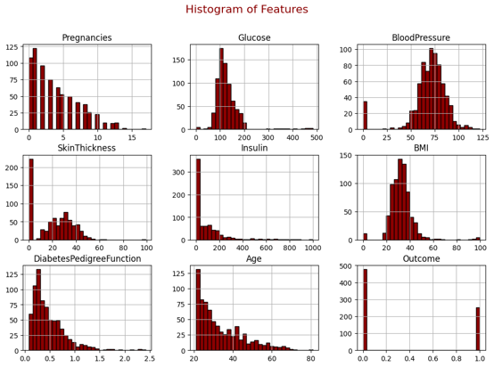

### Pair Plot (Glucose vs Insulin)
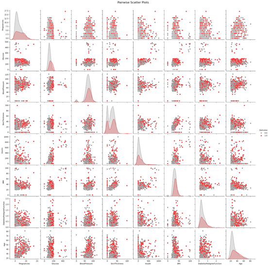

### Box Plot (outliers)
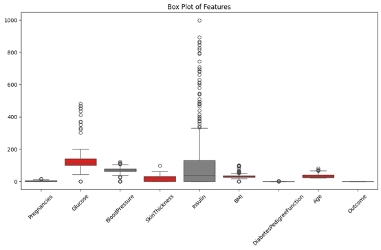

### Correlation Heatmap
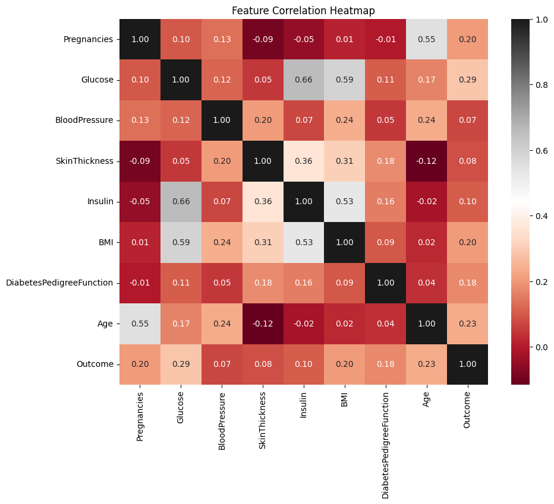

## Preprocessing

- Median imputation for missing values  
  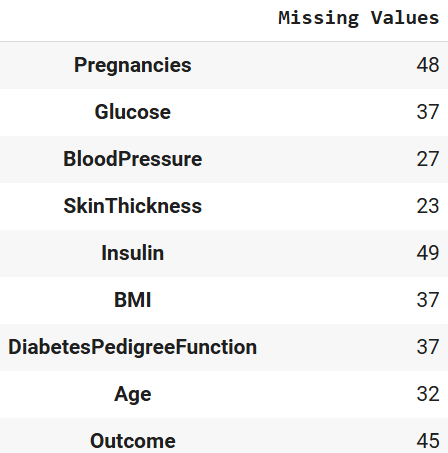 → 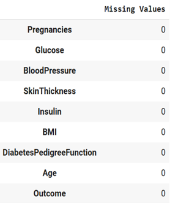
- Robust scaling (median + IQR)  
  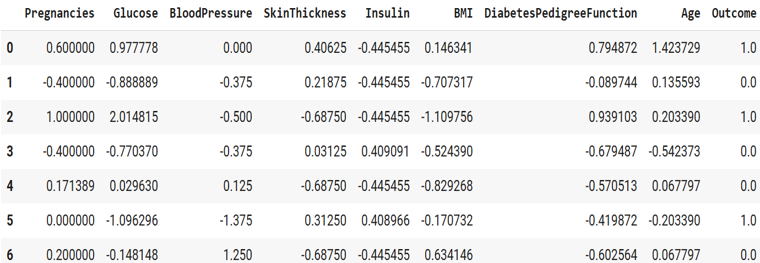
- IQR outlier removal  
  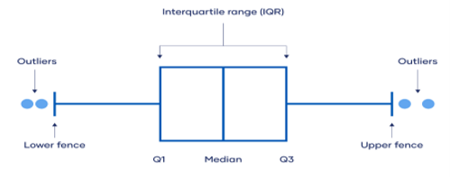
- RandomOverSampler + 80/20 train‑test split  
  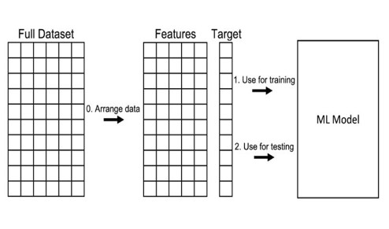

## Models & Confusion Matrices

| Model | Confusion Matrix |
|-------|------------------|
| Random Forest | 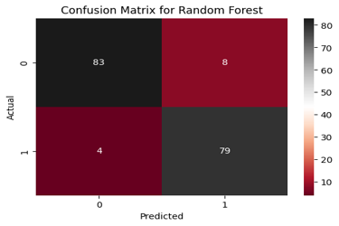 |
| Extra Trees | 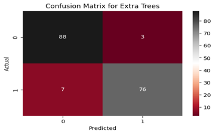 |
| Bagging Classifier | 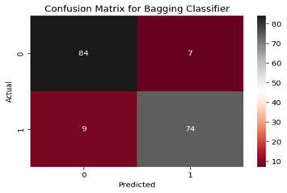 |
| Decision Tree | 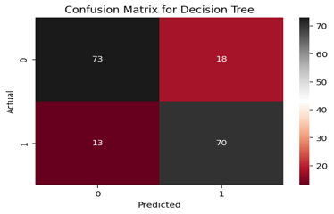 |

## Performance Metrics

| Model            |  Accuracy  |  Precision  |  Recall  |  F1‑Score  |  ROC‑AUC |
|------------------|------------|-------------|----------|------------|----------|
| Extra Trees      |  0.9425    |   0.9620    |  0.9157  |  0.9383    | 0.9781   |
| Random Forest    |  0.9310    |   0.9080    |  0.9518  |  0.9294    | 0.9741   |
| Bagging          |  0.9080    |   0.9136    |  0.8916  |  0.9024    | 0.9584   |
| Decision Tree    |  0.8218    |   0.9755    |  0.8434  |  0.8187    | 0.8849   |

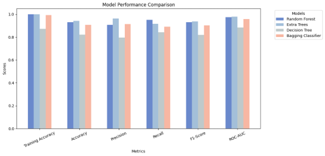

### ROC Curves
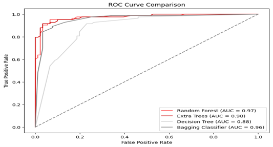

## Conclusion

**Extra Trees** performs best overall. Random Forest is also strong. Decision Tree weakest. Future improvements: hyperparameter tuning, testing on larger real‑world data.

## References

- scikit‑learn documentation (Random Forest, Extra Trees, Bagging)
- Evidently AI – Precision/Recall guide
- Bhandari, P. – Interquartile Range (Scribbr)
